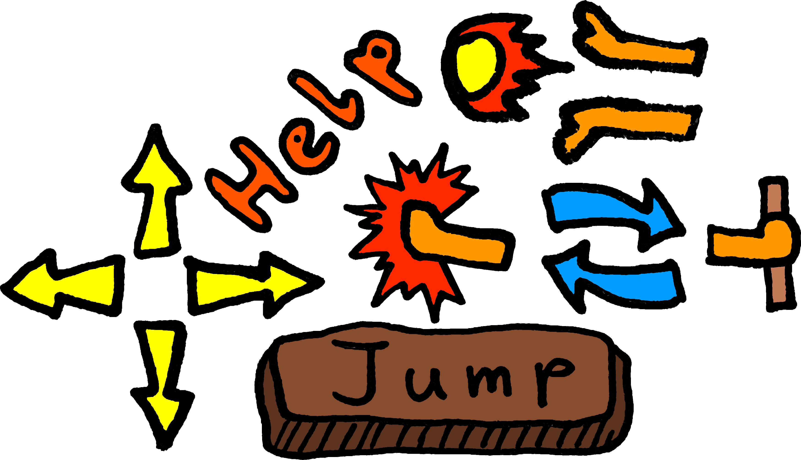

# What

[BattleBlock Theater®](https://store.steampowered.com/app/238460/BattleBlock_Theater/ "View Steam® store page") is a 2D platformer by [the Behemoth](https://store.steampowered.com/developer/thebehemoth "View Steam® developer page") available on [Steam®](https://store.steampowered.com/ "View website").

## Preview

Each icon is grayed out until the corresponding key is pressed.

### Keybindings

(Keyboard)

Click to toggle table

| Action             | Key             | Image                  |
| ------------------ | --------------- | ---------------------- |
| Move               | `W` `A` `S` `D` | Yellow arrows          |
| Cry for help       | `Q`             | Help                   |
| Jump               | `Space`         | Jump button            |
| Attack             | `H`             | Punch                  |
| Special attack     | `U`             | Fireball (incl. hands) |
| Swap special       | `J`             | Blue Arrows            |
| Grip / lend a hand | `K`             | Hand on pipe           |

[_change keybindings tutorial_](../README.md#change-keybindings "Go back to change keybindings tutorial")

## Files

- [layout image](./layers_table.png "open layers_table.png file")
- [layout config](./overlay.json "open overlay.json file")
