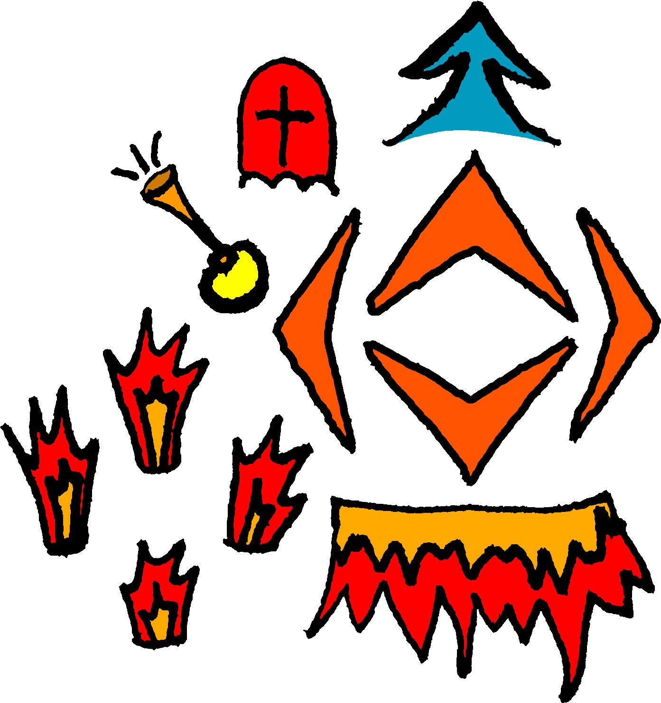

# What

[Distance](https://store.steampowered.com/app/233610/Distance/ "View Steam® store page") is an atmospheric racing platformer by [Refract Studios](https://store.steampowered.com/developer/refract "View Steam® developer page") available on [Steam®](https://store.steampowered.com/ "View website").

## Preview

Each icon is grayed out until the corresponding key is pressed.

### Keybindings

(Keyboard)

Click to toggle table

| Action             | Key             | Image                  |
| ------------------ | --------------- | ---------------------- |
| Gas/Brake/Steer    | `↑` `←` `↓` `→` | Orange Arrows          |
| Jets               | `W` `A` `S` `D` | Flame Jets             |
| Jump               | `Space`         | Blue Arrow             |
| Boost              | `Shift`         | Wide Flame             |
| Reset              | `R`             | Red Tombstone          |
| Horn               | `X`             | Yellow/Orange Horn     |

[_change keybindings tutorial_](../README.md#change-keybindings "Go back to change keybindings tutorial")

## Files

- [layout image](./layers_table.png "open layers_table.png file")
- [layout config](./overlay.json "open overlay.json file")
